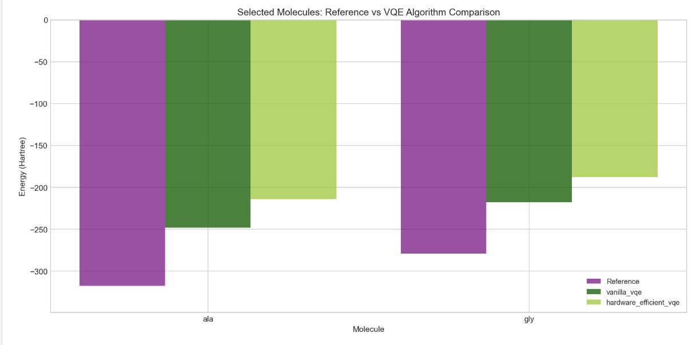

# qmprot_gse

Looking at the QMProt dataset - investigating the use of using VQE in order to calculate GSE of amino acids (using Hamiltonians provided through QMProt).

Also, a one-stop repository for researchers to run various VQE algorithms on their own dataset, and compare results and computational cost. Compatible with standard Hamiltonian formatting.

# How to use this repository:
1) Download the Hamiltonians through the Hamiltonian_download notebook
2) Run main.py in framework! Make sure to have requirements installed :)

Example running:
timeout 120 python main.py --molecule ala gly --algorithm vanilla_vqe --max-iterations 30 --max-hamiltonian-terms 300 2>&1 | tail -60

Usage: 
main.py [-h] [--all] [--all-algorithms] [--all-molecules] [--plot-only] 

To do for the read me:
* more sample photos
* more specifics about input data parameters

Next steps in the research:
* Calculate not just GSE, but also 1st excited states.
* move the ipynb hamiltonian download to a .py script

