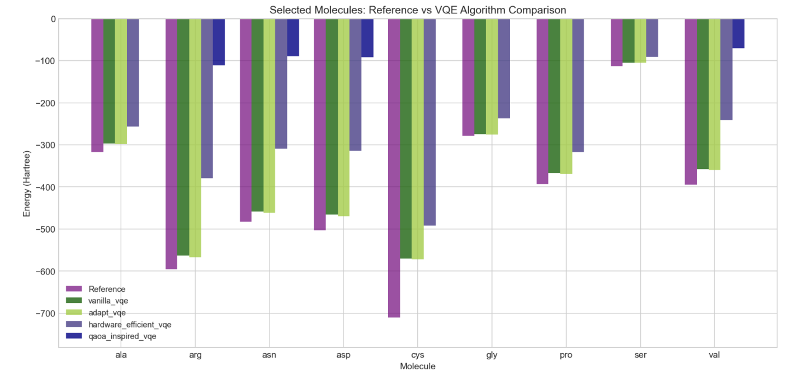

# qmprot_gse

# Overview
qmprot_gse investigates the use of Variational Quantum Eigensolver (VQE) algorithms to compute ground-state energies (GSE) of amino acids using Hamiltonians derived from the QMProt dataset.

The repository serves both as a research platform for benchmarking VQE variants and as a modular framework for users to run VQE algorithms on their own data and discover which VQEs serve their needs best. Compatible with standard Hamiltonian formatting.

Hamiltonians are generated via OpenFermion + PySCF (RHF, STO-3G), reduced to an active orbital basis, and mapped to qubits via the Jordan-Wigner transformation.

# Motivation
Near-term benchmarking is constrained by limited qubit counts and the depth of circuits that current hardware can reliably execute, to such an extent that directly representing large molecular systems is infeasible for the time being.

This repository explores algorithmic tradeoffs under these aforementioned constraints.

# Practical Simulation Limits
This framework uses statevector simulation. Runtime scales exponentially with qubit count:
* 10-12 qubits (5-6 spatial orbitals): Comfortable runtime, highly recommended for practical experimentation.
* 14 qubits: Slow but manageable
* 16+ qubits: Generally impractically slow; ~20 hours runtime observed while running ADAPT-VQE with 16 qubits.

# How to use this repository:
1) Download the Hamiltonians through the Hamiltonian_download notebook
2) Run main.py in framework! Make sure to have requirements installed :)

Example running:
timeout 120 python main.py --molecule ala gly --algorithm vanilla_vqe --max-iterations 30 --max-hamiltonian-terms 300 2>&1 | tail -60

Usage: 
main.py [-h] [--all] [--all-algorithms] [--all-molecules] [--plot-only] 

# Visualization
The framework automatically generates:
* List generated plots here

# Customization
All runtime parameters are configurable via CLI.

To do for the read me:
* more sample photos
* more specifics about input data parameters

Next steps in the research:
* Calculate not just GSE, but also 1st excited states.
* move the ipynb hamiltonian download to a .py script

