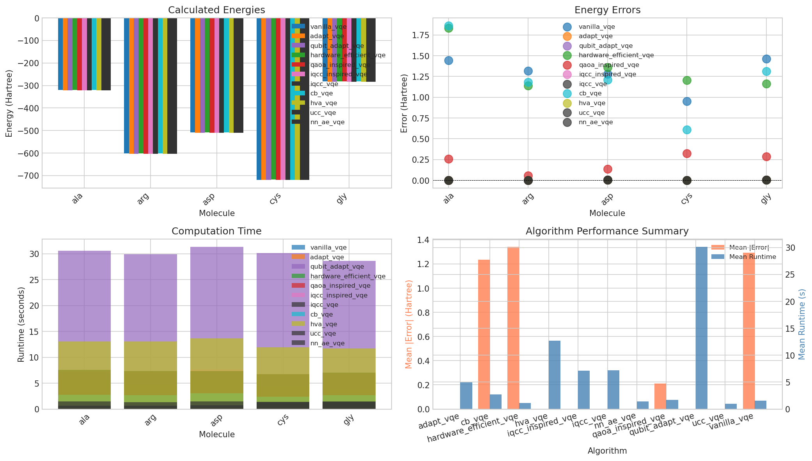
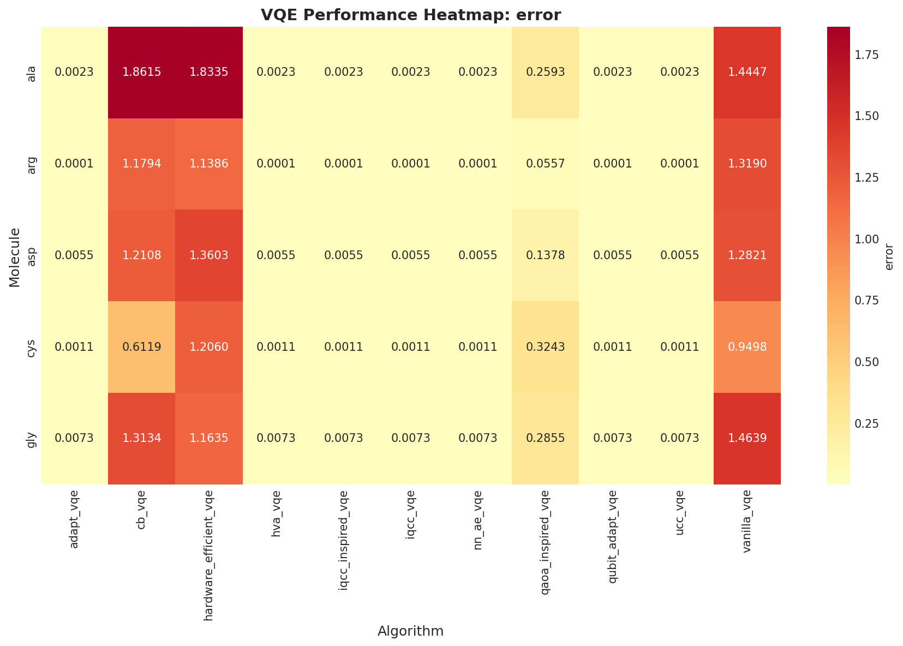
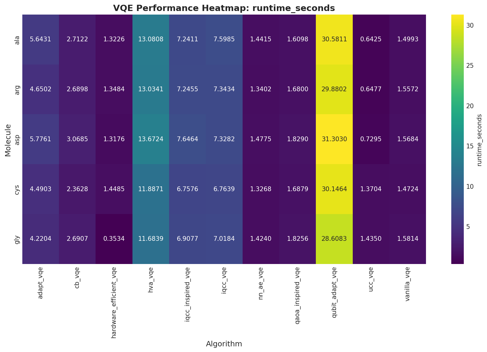
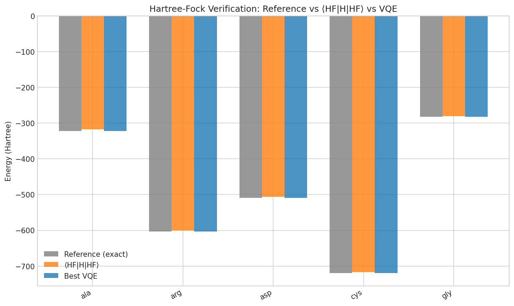
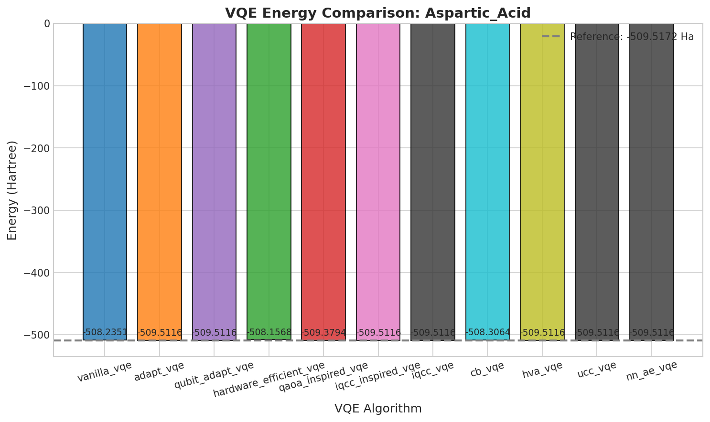
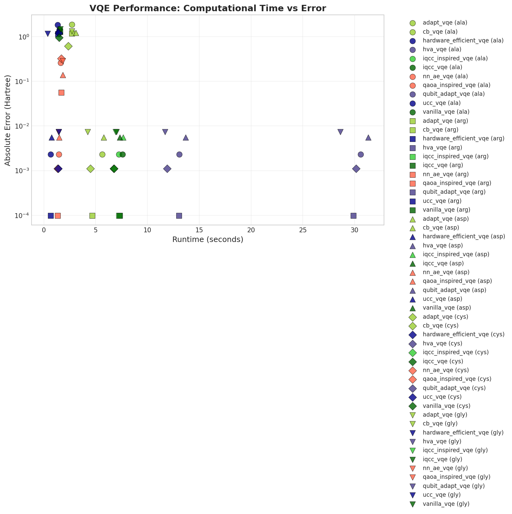

# VQE Framework for Protein Hamiltonians

A modular framework for running and benchmarking multiple VQE (Variational Quantum Eigensolver) algorithms on protein Hamiltonians from the QMProt dataset. Enables algorithm comparison, active-space benchmarking, and rapid prototyping of new ansatz.

## Latest Benchmark Results (2026-03-18)

Full run: **11 algorithms × 5 amino acids** (ALA, ARG, ASP, CYS, GLY), 8 qubits per molecule after contextual subspace reduction from a (10e,7o) [or (12e,7o) for CYS] active space.



### Energy Errors vs. CASCI Reference

| Molecule | CASCI Ref (Ha) | HF (Ha) | Best error (Ha) | Best algorithms |
|----------|---------------|---------|----------------|-----------------|
| ALA | −321.892 | −317.371 | 0.00232 | ADAPT, iQCC, UCC, NN-AE |
| ARG | −602.934 | −600.089 | 0.000098 | ADAPT, iQCC, UCC, NN-AE |
| ASP | −509.517 | −506.088 | 0.00554 | ADAPT, iQCC, UCC, NN-AE |
| CYS | −719.414 | −716.732 | 0.00111 | ADAPT, iQCC, UCC, NN-AE |
| GLY | −282.862 | −280.008 | 0.00733 | ADAPT, iQCC, UCC, NN-AE |

All errors are **positive** (variational principle holds). Chemical accuracy threshold (1.6 mHa) is approached or met by ADAPT/iQCC/UCC/NN-AE on ARG.

### Algorithm × Molecule Heatmap





### HF Energy Verification



### Per-Molecule Comparisons





### Computation Cost vs. Error



## 📁 Project Structure

```
framework/
├── README.md
├── requirements.txt
├── main.py                        # Main entry point
├── config.py                      # Configuration settings
├── active_space_truncation/       # Pipeline: geometry → HF → CASCI → qubit Hamiltonian
│   ├── geometry.py                # Molecule geometry dataclass
│   ├── step1_orbitals.py          # HF + MP2 + orbital diagnostics
│   ├── step2_active_space.py      # CASCI active-space validation
│   └── step3_hamiltonian.py       # Qubit Hamiltonian via PySCF + OpenFermion
├── contextual_subspace/           # Contextual subspace (CS) reduction
│   ├── core.py                    # Noncontextual ground-state solver
│   └── cs_reduction.py            # 14 → 8 qubit CS projection
├── core/
│   ├── hamiltonian_loader.py      # Load Hamiltonians from .h5 / .txt / .json
│   ├── base_vqe.py                # Base VQE class
│   ├── hf_verification.py         # ⟨HF|H|HF⟩ verification before VQE
│   └── results_manager.py         # Save/load results
├── algorithms/
│   ├── vqe_vanilla.py             # Standard VQE (hardware-efficient ansatz)
│   ├── vqe_adapt.py               # ADAPT-VQE
│   ├── vqe_qubit_adapt.py         # Qubit-ADAPT-VQE
│   ├── vqe_hardware_efficient.py  # Hardware-efficient layered ansatz
│   ├── vqe_qaoa_inspired.py       # QAOA-inspired VQE
│   ├── vqe_iqcc.py                # iQCC (iterative qubit coupled clustering) with truncated approximation of canonical transform
│   ├── vqe_iqcc_inspired.py       # iQCC-inspired ADAPT variant
│   ├── vqe_CB.py                  # Classically boosted VQE
│   ├── vqe_hva.py                 # Hamiltonian variational ansatz
│   ├── vqe_ucc.py                 # UCC singles & doubles
│   └── vqe_nn_ae.py               # Neural-network autoencoder VQE
├── plotting/
│   └── visualizer.py
├── datasets/                      # Pre-built .h5 Hamiltonians (ala/arg/asp/cys/gly)
├── results/                       # Output JSON + CSV
└── plots/                         # Generated plots (timestamped subdirs)
```

## 🔬 Hamiltonian Pipeline

The `active_space_truncation/` pipeline builds qubit Hamiltonians directly from molecular geometry without needing pre-stored Hamiltonian files:

1. **Step 1** — RHF + MP2, orbital diagnostics, propose (10e,7o) active space  
2. **Step 2** — CASCI validation: confirms `E_CASCI < E_HF`  
3. **Step 3** — PySCF `ao2mo.full()` on active-space MOs only (avoids `n_basis⁴` OOM), spin-orbital expansion via OpenFermion's `spinorb_from_spatial` convention, Jordan–Wigner transformation → 14-qubit Hamiltonian  
4. **CS reduction** — Contextual subspace projector reduces 14 → 8 qubits while preserving the ground state

Pre-built `.h5` Hamiltonians for all 5 molecules are stored in `datasets/`.


## 🚀 Quick Start

### 1. Install Dependencies

```bash
cd framework
pip install -r requirements.txt
```

### 2. Run the Framework

```bash
# Run all algorithms on all molecules
python main.py --all

# Run specific algorithm on specific molecule
python main.py --molecule ala --algorithm adapt_vqe

# Run all algorithms on one molecule
python main.py --molecule arg --all-algorithms

# Generate plots only (from existing results)
python main.py --plot-only
```

### 3. Using the Hamiltonian Pipeline (optional)

Pre-built `.h5` Hamiltonians are in `datasets/`. To rebuild from scratch:

```python
from active_space_truncation.geometry import MoleculeGeometry
from active_space_truncation.step1_orbitals import run_orbital_diagnostics
from active_space_truncation.step2_active_space import validate_active_space
from active_space_truncation.step3_hamiltonian import build_qubit_hamiltonian

geom = MoleculeGeometry.from_name("alanine")
diag = run_orbital_diagnostics(geom)
active = validate_active_space(geom, diag)
ham = build_qubit_hamiltonian(geom, active, diag)
```

## Supported VQE Algorithms

| # | Name | Key feature |
|---|------|-------------|
| 1 | **Vanilla VQE** | Hardware-efficient layered ansatz |
| 2 | **ADAPT-VQE** | Adaptive operator pool, grows ansatz by gradient |
| 3 | **Qubit-ADAPT-VQE** | ADAPT with Pauli-string pool |
| 4 | **Hardware-Efficient VQE** | Parameterized layers of Ry + CNOT |
| 5 | **QAOA-Inspired VQE** | QAOA-style cost/mixer alternation |
| 6 | **iQCC VQE** | Iterative qubit coupled clustering |
| 7 | **iQCC-Inspired VQE** | ADAPT variant using iQCC operator pool |
| 8 | **CB VQE** | Classically boosted VQE |
| 9 | **HVA VQE** | Hamiltonian variational ansatz |
| 10 | **UCC VQE** | Unitary coupled-cluster singles & doubles |
| 11 | **NN-AE VQE** | Neural-network autoencoder ansatz |

## Visualization

The framework generates multiple types of plots:

- **Per-molecule plots**: Compare all algorithms for each molecule
- **Per-algorithm plots**: Compare all molecules for each algorithm
- **Energy convergence plots**: Track optimization progress
- **Error analysis**: Compare calculated vs. reference energies
- **Heatmaps**: Algorithm × Molecule performance matrix

## Adding New Algorithms

1. Create a new file in `algorithms/` (e.g., `vqe_custom.py`)
2. Inherit from `BaseVQE` class
3. Implement the required methods:
   - `build_ansatz()`
   - `run()`
4. Register in `algorithms/__init__.py`

Example:

```python
from core.base_vqe import BaseVQE

class CustomVQE(BaseVQE):
    def __init__(self, hamiltonian, **kwargs):
        super().__init__(hamiltonian, **kwargs)
        self.name = "custom_vqe"
    
    def build_ansatz(self):
        # Your ansatz implementation
        pass
    
    def run(self):
        # Your VQE implementation
        return self.optimize()
```

## Input Format

### Hamiltonian Files (`.txt`)

```
Coefficient	Operators
0.123456	IIII
-0.234567	ZIIZ
0.345678	XXYY
...
```

### Molecule Metadata (`qmprot.json`)

```json
{
  "amino_acids": [
    {
      "abbreviation": "trp",
      "name": "tryptophan",
      "n_qubits": 148,
      "n_coefficients": 42567891,
      "hamiltonian": "hamiltonian_trp.txt",
      "energy": -672.12345
    }
  ]
}
```

## 📤 Output Format

Results are saved in `results/` as JSON:

```json
{
  "molecule": "trp",
  "algorithm": "vanilla_vqe",
  "calculated_energy": -672.12340,
  "reference_energy": -672.12345,
  "error": 0.00005,
  "n_iterations": 150,
  "runtime_seconds": 45.2,
  "convergence_history": [...]
}
```

## License

MIT License
